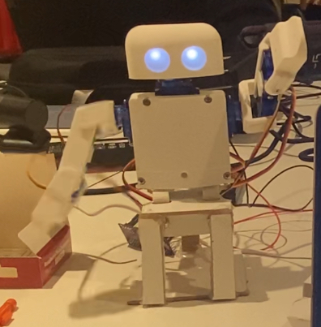
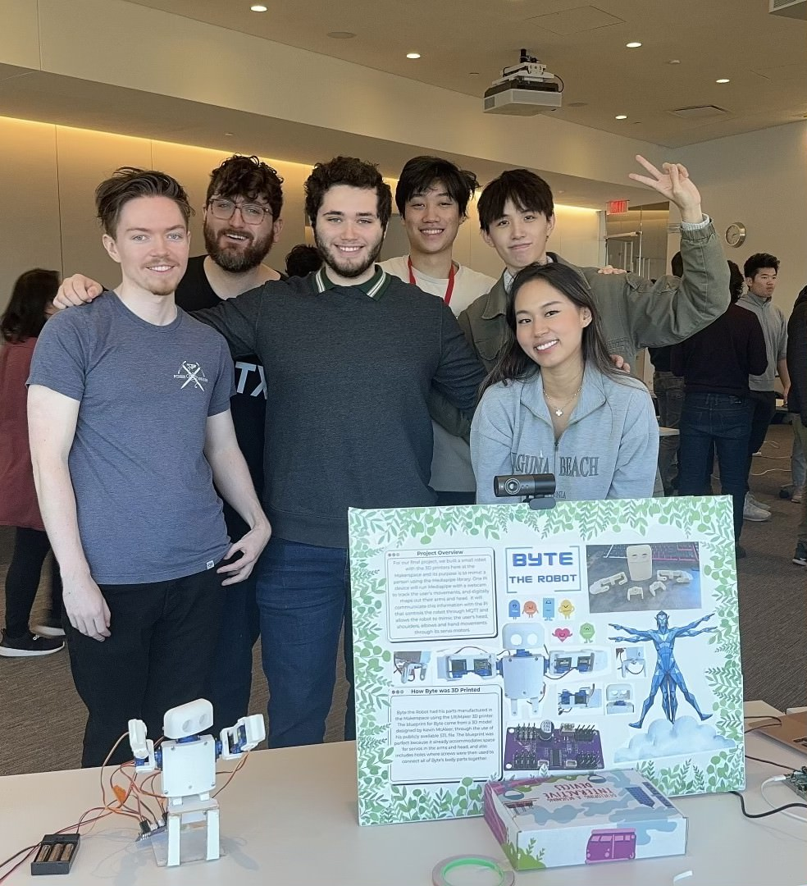

# Byte-The-Robot
A 3D-printed robot capable of mimicking human movements using Mediapipe and Raspberry Pi.



## Course Context  
This project was completed as part of the **Interactive Device Design** course at Cornell Tech during Fall 2023. The course focused on the principles of hardware-software integration, rapid prototyping, and creating functional interactive devices. Over the span of a semester, the course provided opportunities to explore emerging technologies, develop innovative solutions, and bring ideas from concept to execution.

---

## Project Overview  
**Byte the Robot** is a 3D-printed humanoid robot designed to mimic human arm and head movements in real-time. This project aimed to bridge human motion capture and robotic replication by leveraging **Mediapipe**, a powerful computer vision library, in conjunction with a Raspberry Pi and MQTT communication protocols. The robot acts as an “avatar,” translating user gestures into fluid robotic movements, enabling natural and interactive experiences.

  
*The Byte the Robot team with the final product, showcasing its innovative design and functionality.*

### Key Features:  
- **Motion Tracking:** Utilized Mediapipe to process webcam data, capturing user movements (head, shoulders, elbows, and hands) and translating them into commands for the robot.  
- **3D Printing & Assembly:** Constructed using publicly available STL files, with design adjustments to focus on upper body mobility for head and arm movements.  
- **Servo Motor Integration:** Implemented servo motors with an Adafruit ServoKit for precise, life-like articulation of the robot’s joints.  
- **Speech-to-Text Interaction:** Integrated the Vosk speech-to-text model to enable voice commands for basic interactions.  
- **Real-Time Communication:** Deployed MQTT protocols to synchronize Mediapipe's processed data with the Raspberry Pi controlling the robot.  
- **GPIO LED Feedback:** Utilized GPIO pins on the Raspberry Pi to manage visual feedback for operational status.

---

## Getting Started  
Follow these instructions to set up, assemble, and run Byte the Robot.

### Prerequisites  
1. **Hardware Requirements:**  
   - Two Raspberry Pi devices (one for Mediapipe processing and the other for robot control).  
   - Seven servo motors (compatible with the robot’s STL file design).  
   - Webcam for motion tracking.  
   - Adafruit ServoKit (16 channels at 60Hz).  
   - GPIO-enabled LED for visual feedback.

2. **Software Requirements:**  
   - **Python 3.7+** installed on both Raspberry Pis.  
   - Required Python libraries:  
     ```bash
     pip install adafruit-circuitpython-servokit paho-mqtt mediapipe sounddevice vosk
     ```
   - MQTT configuration:  
     - Update the MQTT broker, port, username, and password in the scripts (`detect.py` and `controlRobot.py`) to match your preferred setup.  

3. **3D Printing:**  
   - STL files for the robot’s body parts are available in the [Original Repository](https://github.com/Ruiznogueras05CT/Interactive-Lab-Hub/tree/Fall2023/Final%20Project).  
   - Use a 3D printer to manufacture the robot parts.  
   - Assemble the robot using screws and connect the servo motors as per the provided diagrams.

---

### Running the Project  
1. **Setup the Raspberry Pis:**  
   - **First Pi (User Tracking):**  
     - Connect a webcam and run `detect.py`.  
     - Ensure this Pi processes user movements using Mediapipe and publishes motion commands to MQTT.  
   - **Second Pi (Robot Control):**  
     - Connect the robot’s servo motors and LED.  
     - Run `controlRobot.py` to subscribe to MQTT topics and control the robot.

2. **Power and Test:**  
   - Ensure both Pis are powered and connected via MQTT.  
   - Position the webcam to track user movements effectively.

3. **Execute the Scripts:**  
   - Run `detect.py` on the Pi connected to the webcam.  
   - Run `controlRobot.py` on the Pi managing the robot.

4. **Interact and Enjoy:**  
   - Use voice commands or gestures to interact with the robot in real-time.  

---

## Development Timeline  
- **November 14:** Project Plan Pitch.  
- **November 21:** System design and diagram creation.  
- **November 28 & 30:** Began 3D printing the robot's components.  
- **December 5 & 7:** Assembled the robot and iterated on its functionality.  
- **December 10:** Finalized the design and prepared the project presentation poster.  
- **December 12:** Presented the completed project.  
- **December 14:** Submitted final project documentation.  

---

## Reflections and Future Improvements  
### Achievements:  
- Demonstrated the feasibility of using Mediapipe and Raspberry Pi to achieve real-time robotic motion replication.  
- Validated the ability to translate complex user motions into smooth robotic articulation.  
- Highlighted the potential for social robotics in enhancing human-robot interaction.  

### Future Enhancements:  
- **Advanced Servo Mechanics:** Improve servo quality and refine control algorithms for smoother motion.  
- **Enhanced Tracking:** Incorporate advanced Mediapipe features to capture more detailed user movements, especially for hand gestures.  
- **Improved Speech-to-Text Models:** Experiment with alternative models for better voice command recognition and response.  
- **Articulated Elbows:** Upgrade the robot design to support more sophisticated joint movements.  

---

## Group Contribution  
- **Gilberto Ruiz, Ben Setel, Michael Hanlon:** Programming, assembly, and 3D printing.  
- **Gloria Hu:** Design and 3D printing.  
- **Kenneth Lee:** Testing and assembly.  
- **Yifan Yu:** Documentation and 3D printing.  

---

## Disclaimer  
This repository was developed as part of an academic course at Cornell Tech and is shared for educational and demonstration purposes. It is not intended for commercial use or redistribution. Please contact me directly if you have questions or wish to use any part of this project.

---

## Final Product Code

The following scripts represent the final implementation of Byte the Robot:

- **`controlRobot.py`**: Handles the robotic control systems by receiving processed motion data via MQTT and translating it into servo motor commands. This script ensures the robot mimics the user’s head and arm movements in real-time with precision.

- **`detect.py`**: Processes webcam data using Mediapipe to capture user movements, including head, shoulders, elbows, and hands. The script then publishes the processed data to the MQTT server, enabling communication with the robot's control system.


## Media and Documentation

1. **Original Repository:**  
   Explore the original course repository for Interactive Device Design at Cornell Tech, which includes all group project files, iterations, and collaborative efforts:  
   [Original Repository](https://github.com/Ruiznogueras05CT/Interactive-Lab-Hub/tree/Fall2023/Final%20Project)  

2. **Additional Media (Video):**  
   Watch a demonstration video showcasing the functionality and features of Byte the Robot:  
   [Byte the Robot Demo Video](https://drive.google.com/file/d/1-GGnieB91tHJyQQbQX1yrb3Hj7tQHQkH/view?usp=sharing)  
 
